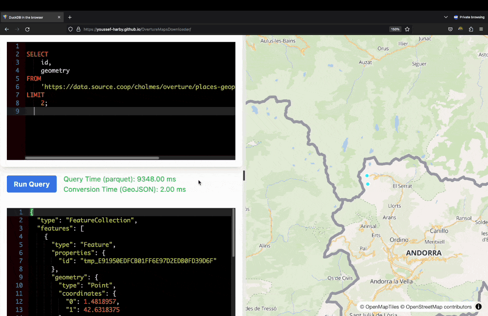

# Overture Maps Downloader

This repository is still under heavy development. Features may change, and documentation will be updated accordingly. Use at your own risk and feel free to contribute!

## Overview

OvertureMapsDownloader is a monorepo that contains two main projects aimed at simplifying the process of working with Overture Maps data in Parquet format.

### DuckDB-WASM with Map

The first project is a browser-based application that leverages DuckDB-WASM and mapping functionalities. This allows you to query Overture Maps data in Parquet format directly within your web browser. It offers a seamless and interactive way to work with geospatial data without the need for any backend services. The codebase for this project is located in the `/app` folder.

### Data Manipulation/Downloading and Conversion

The second project focuses on data manipulation, downloading, and conversion of Overture Maps data. It utilizes technologies like DuckDB, Python, and IPython Notebooks, along with GDAL/OGR for data conversion. This project is containerized using Docker, making it easy to integrate into existing pipelines and ETL workflows. For hands-on examples, check out the Jupyter notebooks available in the `examples` folder.

Whether you're a data scientist, a geospatial analyst, or a developer, OvertureMapsDownloader offers comprehensive solutions for your geospatial data needs.

## Table of Contents

- [Overture Maps Downloader](#overture-maps-downloader)
  - [Overview](#overview)
    - [DuckDB-WASM with Map](#duckdb-wasm-with-map)
    - [Data Manipulation/Downloading and Conversion](#data-manipulationdownloading-and-conversion)
  - [Table of Contents](#table-of-contents)
    - [DuckDB-WASM in Browser (Developers)](#duckdb-wasm-in-browser-developers)
    - [Getting Started](#getting-started)
    - [Visual Demo](#visual-demo)
    - [Data Manipulation/Downloading and Conversion](#data-manipulationdownloading-and-conversion-1)
  - [Prerequisites](#prerequisites)
  - [Installation](#installation)
      - [the docker image manily contains the following tools:](#the-docker-image-manily-contains-the-following-tools)
  - [Usage](#usage)
    - [Download Geospatial Data](#download-geospatial-data)
      - [Commands](#commands)
  - [Examples of downloading data CLI:](#examples-of-downloading-data-cli)
    - [With Docker:](#with-docker)
    - [Without Docker you can use the following commands with (`pip install overturemapsdownloader`):](#without-docker-you-can-use-the-following-commands-with-pip-install-overturemapsdownloader)
    - [Convert Parquet to GeoPackage](#convert-parquet-to-geopackage)
    - [Convert Parquet to MBTiles (will support tippecanoe in the future)](#convert-parquet-to-mbtiles-will-support-tippecanoe-in-the-future)
    - [Convert Parquet to ESRI File Geodatabase vector (OpenFileGDB)](#convert-parquet-to-esri-file-geodatabase-vector-openfilegdb)
  - [Using Jupyter Notebooks (Data Scientists/GIS Analysts)](#using-jupyter-notebooks-data-scientistsgis-analysts)
  - [Configuration](#configuration)
  - [Roadmap](#roadmap)
    - [DuckDB-WASM in Browser (Developers)](#duckdb-wasm-in-browser-developers-1)
  - [Contributing](#contributing)

### DuckDB-WASM in Browser (Developers)

For developers interested in running DuckDB-WASM in the browser, the relevant codebase is located in the `/app` folder at the root of the repository. This setup allows you to develop, run, and build the DuckDB-WASM component seamlessly.

### Getting Started

1. Navigate to the `/app` folder:

   ```bash
   cd /app
   ```

2. Install the required packages:

   ```bash
   yarn install
   ```

   > Note: Make sure you have npm version 18 or above for compatibility.

3. Start the development server:

   ```bash
   yarn dev
   ```

### Visual Demo

<p align="center">
  
</p>

### Data Manipulation/Downloading and Conversion

## Prerequisites

- Docker and Docker Compose
- GeoJSON file containing the bounding box polygon (e.g., `bbox.geojson`)
  **you can make yours easly on https://geojson.io or use `examples/bbox.json` for testing**

## Installation

To get started, you'll need to pull the Docker image from the GitHub Container Registry:

```bash
docker pull ghcr.io/youssef-harby/overturemapsdownloader:latest
```

#### the docker image manily contains the following tools:

- GDAL/OGR v3.7.2
- Python v3.10 (and GDAL/OGR Python bindings + duckdb python bindings)
- DuckDB v0.8.1
- Jupyter.. and more

## Usage

### Download Geospatial Data

1. Create a folder and place your bounding box polygon in GeoJSON format inside it (e.g., `bbox.geojson`).
2. Navigate to the folder:

   ```bash
   cd /examples # e.g., cd /path/to/your/folder contains bbox.geojson and will contain the output file
   ```

3. Run the following command to download geospatial data:

   ```bash
   docker run -v $(pwd):/examples ghcr.io/youssef-harby/overturemapsdownloader:latest OMDownloader omaps --theme places --ptype place --bbox /examples/bbox.geojson --output /examples/places.parquet
   ```

#### Commands

The omaps Command

```bash
OMDownloader omaps [OPTIONS]
```

options:

- `--theme [admins|buildings|buildings|places|transportation]` Theme of the data to download
- `--ptype [locality|administrativeBoundary|building|place|water|connector|segment]` Type of the data to download
- `--bbox PATH` Bounding box polygon in GeoJSON format as a path to a file
- `--output PATH` Output file path (e.g., `places.parquet`)
- `--help` Show this message and exit.

## Examples of downloading data CLI:

### With Docker:

```bash
# admins/locality
docker run -v $(pwd):/examples ghcr.io/youssef-harby/overturemapsdownloader:latest OMDownloader omaps --theme admins --ptype locality --bbox /examples/bbox.geojson --output /examples/locality.parquet

# admins/administrativeBoundary
docker run -v $(pwd):/examples ghcr.io/youssef-harby/overturemapsdownloader:latest OMDownloader omaps --theme admins --ptype administrativeBoundary --bbox /examples/bbox.geojson --output /examples/admins.parquet

# buildings/building
docker run -v $(pwd):/examples ghcr.io/youssef-harby/overturemapsdownloader:latest OMDownloader omaps --theme buildings --ptype building --bbox /examples/bbox.geojson --output /examples/building.parquet

# places/place
docker run -v $(pwd):/examples ghcr.io/youssef-harby/overturemapsdownloader:latest OMDownloader omaps --theme places --ptype place --bbox /examples/bbox.geojson --output /examples/place.parquet

# transportation/connector
docker run -v $(pwd):/examples ghcr.io/youssef-harby/overturemapsdownloader:latest OMDownloader omaps --theme transportation --ptype connector --bbox /examples/bbox.geojson --output /examples/connector.parquet

# transportation/segment
docker run -v $(pwd):/examples ghcr.io/youssef-harby/overturemapsdownloader:latest OMDownloader omaps --theme transportation --ptype segment --bbox /examples/bbox.geojson --output /examples/segment.parquet
```

### Without Docker you can use the following commands with (`pip install overturemapsdownloader`):

```bash
# admins/locality
OMDownloader omaps --theme admins --ptype locality --bbox examples/bbox.geojson --output examples/locality.parquet

# admins/administrativeBoundary
OMDownloader omaps --theme admins --ptype administrativeBoundary --bbox examples/bbox.geojson --output examples/admins.parquet

# buildings/building
OMDownloader omaps --theme buildings --ptype building --bbox examples/bbox.geojson --output examples/building.parquet

# places/place
OMDownloader omaps --theme places --ptype place --bbox examples/bbox.geojson --output examples/place.parquet

# transportation/connector
OMDownloader omaps --theme transportation --ptype connector --bbox examples/bbox.geojson --output examples/connector.parquet

# transportation/segment
OMDownloader omaps --theme transportation --ptype segment --bbox examples/bbox.geojson --output examples/segment.parquet
```

### Convert Parquet to GeoPackage

To convert the downloaded data to GeoPackage format, run the following command:

```bash
docker run -v $(pwd):/examples ghcr.io/youssef-harby/overturemapsdownloader:latest ogr2ogr /examples/output.gpkg /examples/places.parquet
```

### Convert Parquet to MBTiles (will support tippecanoe in the future)

```bash
docker run -v $(pwd):/examples ghcr.io/youssef-harby/overturemapsdownloader:latest ogr2ogr -dsco MAXZOOM=14 /examples/output.mbtiles /examples/places.parquet
```

### Convert Parquet to ESRI File Geodatabase vector (OpenFileGDB)

```bash
docker run -v $(pwd):/examples ghcr.io/youssef-harby/overturemapsdownloader:latest ogr2ogr /examples/output.gdb /examples/places.parquet
```

## Using Jupyter Notebooks (Data Scientists/GIS Analysts)

If you prefer to use Jupyter notebooks for your geospatial data manipulation tasks, you can easily set up a Jupyter environment using Docker Compose.

1. Clone the repository:

   ```bash
   git clone https://github.com/Youssef-Harby/OvertureMapsDownloader.git
   ```

2. Navigate to the repository folder:

   ```bash
   cd OvertureMapsDownloader
   ```

3. Run the following Docker Compose command:

   ```bash
   docker compose up
   ```

This will start a Jupyter notebook server accessible at http://localhost:8888/lab.

## Configuration

For advanced configurations, please refer to the `config.yml` file.

## Roadmap

### DuckDB-WASM in Browser (Developers)

- [ ] Add Popup on click of the feautre to show the result of the query
- [ ] Add a button to use local parquet url instead of the remote one
- [ ] Add a button to download the result of the query as GeoJSON..etc
- [ ] Query by bbox drawn on the map
- [ ] feel free to add more ...

## Contributing

Everyone is invited to contribute to this project. Whether you're a beginner or experienced, your help is valuable. Don't worry about not getting it right the first time; the idea is to grow and learn together.

You can contribute by:

- Commenting on or adding to [existing issues](https://github.com/Youssef-Harby/OvertureMapsDownloader/issues)
- Starting or participating in [discussions](https://github.com/Youssef-Harby/OvertureMapsDownloader/discussions)

If you're new and have questions or need guidance, the [discussions](https://github.com/Youssef-Harby/OvertureMapsDownloader/discussions) page is a great place to start.
